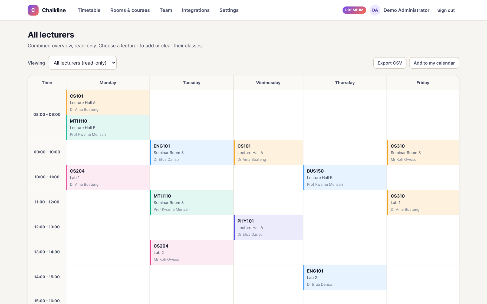
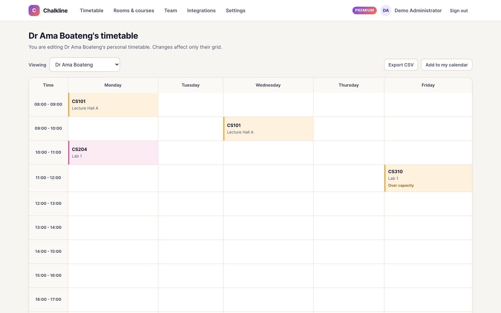
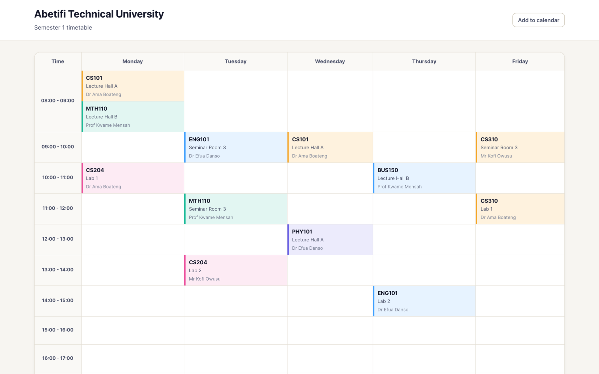
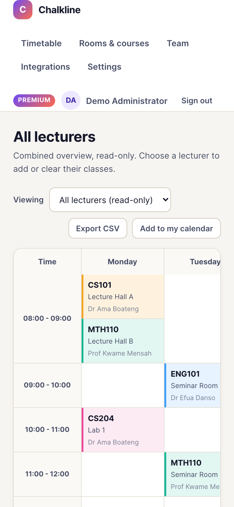
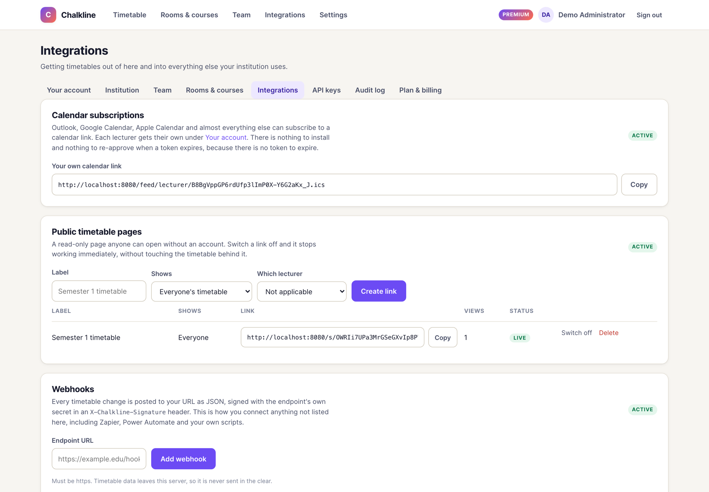
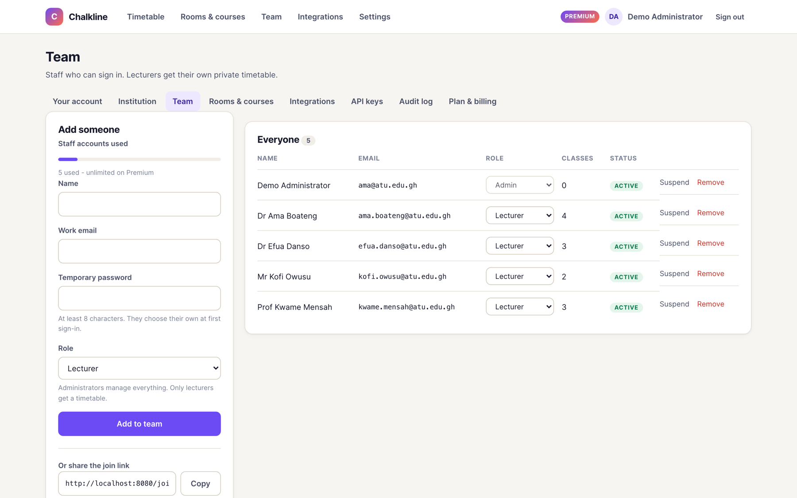
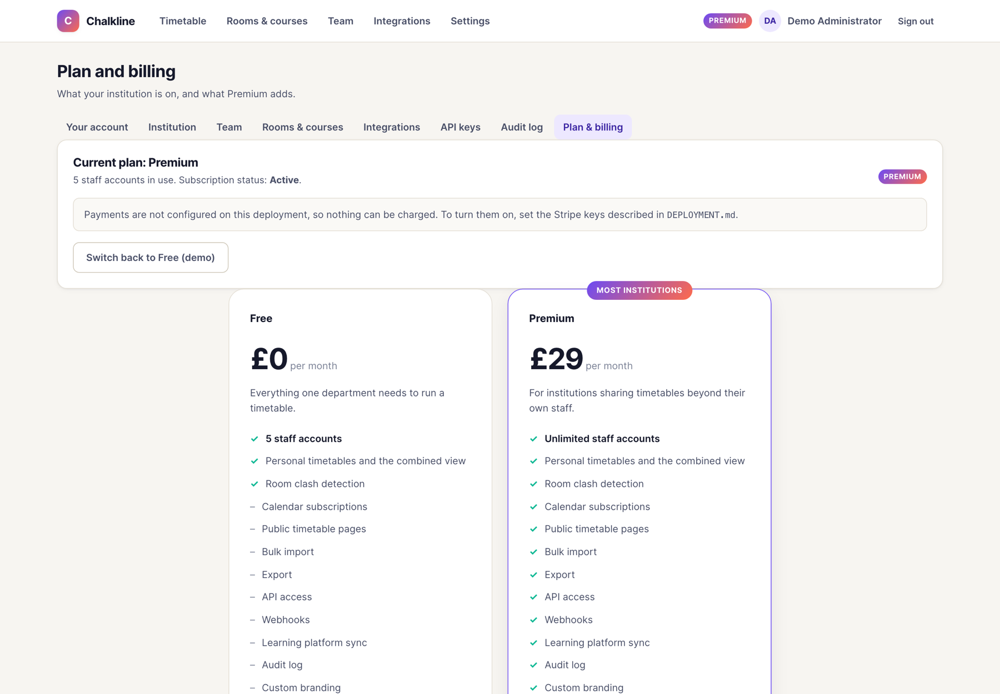
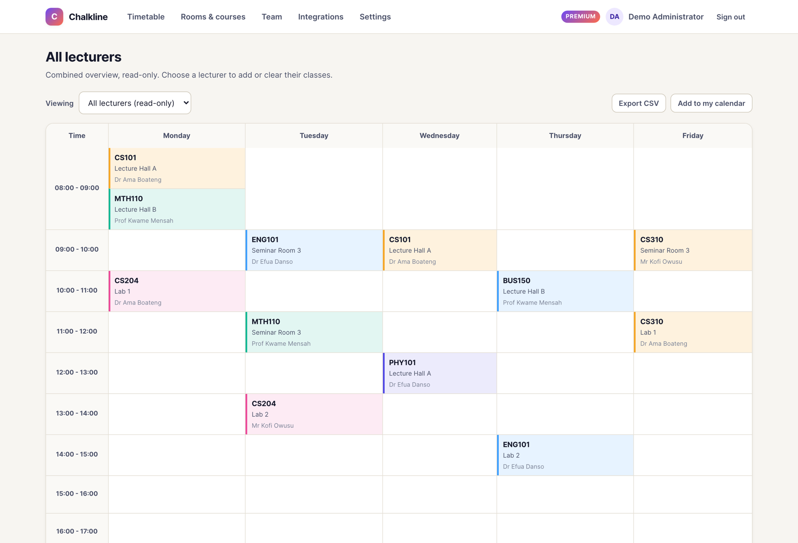
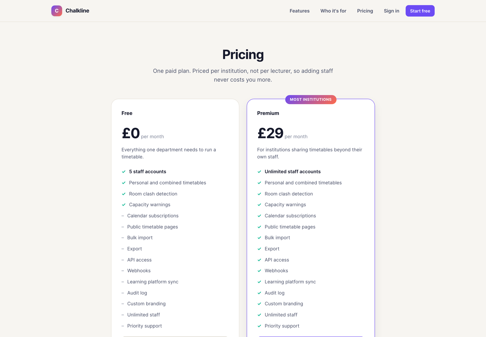

# Chalkline

Timetabling for universities and colleges.

Lecturers manage their own week. Administrators see everyone at once. Students
get a live public page instead of a PDF that was out of date the day it was
sent, and everything syncs to whatever calendar people already use.

Chalkline started as a Java Swing desktop application where every lecturer
needed IntelliJ and each copy kept its own file, so no two people ever saw the
same timetable. This is that idea rebuilt as something a whole institution can
use from a link.

---

## What it looks like

### Walkthrough

A 90-second tour: the landing page, signing in, scheduling a class, a room
clash being refused, the integrations, what a student sees, and the phone
layout.

**[Watch the walkthrough](docs/chalkline-walkthrough.mp4)** &mdash; 90 seconds,
2.4 MB. GitHub plays it in the browser; there is nothing to download.

### The weekly grid

Every lecturer's classes in one view, each course in its own colour so the week
is readable at a glance. Colour is never the only signal: every cell also shows
its course code, so the grid still works in print and for a colour-blind
reader.



An administrator can switch to any single lecturer and edit their week. Click
an empty slot to add a class, or a full one to change it.



### What students see

A read-only page, no account needed, correct the moment you change something.
Switch the link off and it stops working, without touching the timetable behind
it.



### On a phone

The grid scrolls sideways and the add and clear controls stay visible, because
touch screens have no hover.



### Integrations

Calendar subscriptions, public pages and signed webhooks. The page is honest
about what is connected and what is not.



### Team and plan

Staff accounts with a usage meter against the plan's cap, and roles that can be
changed inline.



Plans side by side, with the current one marked. When no Stripe keys are set it
says so plainly rather than offering a button that cannot work.



### The marketing site

Shares one stylesheet with the product, so what a prospect is shown is what
they get.





---

## Run it in two minutes

> **On Windows?** Follow **[RUN-ON-WINDOWS.md](RUN-ON-WINDOWS.md)** instead.
> It covers installing Java, the PowerShell differences, and the errors you are
> most likely to hit.

You need **JDK 21**. Maven is bundled, so use `./mvnw` (or `mvnw.cmd` on
Windows) and you do not have to install it.

```bash
./mvnw spring-boot:run
```

Open <http://localhost:8080>, click **Start free**, and create your institution.
That first account is your administrator.

To start with a demo institution already created:

```bash
DEMO_ORG_EMAIL=you@example.edu DEMO_ORG_PASSWORD=change_this_password \
ALLOW_MANUAL_UPGRADE=true ./mvnw spring-boot:run
```

`ALLOW_MANUAL_UPGRADE=true` puts a button on the billing page that switches your
institution to Premium without paying, so you can see the paid features before
setting up Stripe. It is refused automatically once real payments are configured.

Other useful commands:

```bash
./mvnw test          # 59 tests
./mvnw package       # builds target/chalkline.jar
docker compose up    # runs it against a real PostgreSQL
```

---

## What it does

**Timetables are personal.** A lecturer sees and edits only their own week.
An administrator can open any one lecturer's grid, or a combined read-only view
of the whole institution.

**Clashes are caught as you go.** Two lecturers cannot hold the same room in the
same hour. Put a class of 60 into a room that seats 30 and the grid says so.

**Each institution is separate.** Accounts, rooms, courses and classes all belong
to one institution, and no request can reach across that line. This is tested
directly in `TenancyIsolationTest`, which is the most important file in the
project once there is more than one customer.

### Free plan

Up to 5 staff accounts, personal and combined timetables, rooms and courses,
room clash detection, capacity warnings. It does not expire.

### Premium

Everything above, plus:

| Feature | What it is for |
|---|---|
| Calendar subscriptions | One link puts a lecturer's classes into Outlook, Google or Apple Calendar, and keeps them there |
| Public timetable pages | A read-only page students open with no account |
| Bulk import | Load a department from a spreadsheet instead of typing it in |
| Export | Any timetable as CSV |
| API access | Read timetables from your student portal or website |
| Webhooks | Signed JSON on every change, so Slack, Teams or Zapier can react |
| Audit log | Who changed which class, and when |
| Custom branding | Your colour on the pages students see |
| Unlimited staff | No cap on accounts |

Recorded for everyone, readable on Premium: the audit log. Upgrading should not
produce an empty history, which is exactly when people go looking at it.

---

## Integrations, honestly

**What works today**

- **Calendar subscriptions (.ics).** This is the one that covers the most
  ground. Outlook, Google Calendar, Apple Calendar and nearly everything else
  can subscribe to a URL. No application to register with each vendor, no token
  to expire, no app to install.
- **The read API** at `/api/v1/`, authenticated with a bearer key.
- **Webhooks**, signed with HMAC-SHA256. This is how you connect anything not
  listed here, including Zapier, Power Automate, Slack and Teams.
- **CSV import and export.**

**What is not connected yet**

Microsoft 365 and Google sign-in, Canvas and Moodle. Each needs an application
registered with that vendor, which is a per-deployment setup step rather than
something that can ship in code. The Integrations page lists each one with what
it would need. The configuration blocks are written out and commented in
`application.yml`.

Saying an integration exists when it does not is the fastest way to lose a
customer, so the product says plainly which is which.

---

## How the code is laid out

```
src/main/java/com/chalkline/
  domain/      Organisation, User, Course, Room, TimetableEntry, Plan, Feature,
               ApiKey, ShareLink, WebhookEndpoint, AuditEvent
  repo/        one interface per table; Spring writes the SQL
  service/     the rules: who may edit what, what a plan includes, clashes
  web/         controllers, forms, and the shapes the pages need
  api/         the public REST API
  security/    who is signed in, and the change-password lock
  config/      SecurityConfig, AppProperties, DataSeeder, AsyncConfig
  support/     ScheduleGrid: one institution's days and time slots

src/main/resources/
  application.yml        every setting, with the placeholders marked
  application-prod.yml   what changes in production
  templates/             marketing site, application and public pages
  static/css/app.css     one stylesheet for all three
  static/js/app.js       the only JavaScript; everything works without it
```

Two rules worth keeping:

**Controllers handle the request, services hold the rules.** If you add a
feature, put the decision in a service so it can be tested without a browser and
so a second controller cannot bypass it.

**Hiding a control is not a permission.** Templates hide what a plan does not
include as a courtesy. The check that counts is in `PlanPolicy` or
`TimetableService.requireEditable`, on the server, on the request that would do
the work.

---

## Security notes

- Passwords are bcrypt, via Spring's delegating encoder, so the algorithm can be
  upgraded later without invalidating anyone.
- CSRF protection is on everywhere except the Stripe webhook (authenticated by
  signature) and the API (stateless, key-authenticated).
- A Content-Security-Policy blocks inline scripts and styles. If you add
  styling, put it in `app.css`; if you add behaviour, put it in `app.js`.
- API keys are stored as hashes, never in the clear. A new key is shown once.
- Share links and calendar feeds are protected by 24 random bytes in the URL and
  can be regenerated, because the people using them have no account to sign in
  with.
- Card details never reach this application. Stripe Checkout handles payment on
  its own hosted page.

---

## Tests

```bash
./mvnw test
```

59 tests, covering the things that would be expensive to get wrong:

| File | What it protects |
|---|---|
| `TenancyIsolationTest` | One institution can never see or touch another's data |
| `PlanGatingTest` | Paid features are refused by the service, not just hidden |
| `TimetableRulesTest` | Whose timetable you may edit, room clashes, replacing a slot |
| `AccountRulesTest` | Sign-up, password hashing, the guards on removing people |
| `WebSecurityTest` | Route protection, CSRF, and that every page actually renders |
| `CalendarFeedTest` | The .ics file is well formed and correctly escaped |
| `ErrorRedirectTest` | An error message cannot become an open redirect |

---

## Deploying it

See **[DEPLOYMENT.md](DEPLOYMENT.md)** for the overview and the pre-launch
checklist, then the guide for wherever you are hosting it:

- **[DEPLOY-AZURE.md](DEPLOY-AZURE.md)**
- **[DEPLOY-AWS.md](DEPLOY-AWS.md)**
- **[DEPLOY-GOOGLE-CLOUD.md](DEPLOY-GOOGLE-CLOUD.md)**
- **[DEPLOY-SELF-HOSTED.md](DEPLOY-SELF-HOSTED.md)** for a university server

To run it on your own laptop first, see
**[RUN-ON-WINDOWS.md](RUN-ON-WINDOWS.md)**.

---

## Next steps, roughly in order of value

1. **Forgot-my-password.** Needs the email placeholder filled in. Today an
   administrator resets passwords by hand.
2. **Invitations by email** rather than telling someone a temporary password.
3. **Flyway migrations.** Hibernate currently creates and alters tables
   automatically (`DATABASE_DDL_AUTO=update`), which is fine while the schema is
   still moving and not something to rely on long-term. Once it settles, add
   Flyway and switch to `validate`.
4. **Single sign-on**, so staff use their existing university account. This is
   the most-asked-for thing by institutional IT.
5. **Term dates.** The calendar feed currently repeats weekly forever; real term
   start and end dates would bound it.
6. **A second API version that writes**, once the conflict rules for external
   writes are properly designed.
