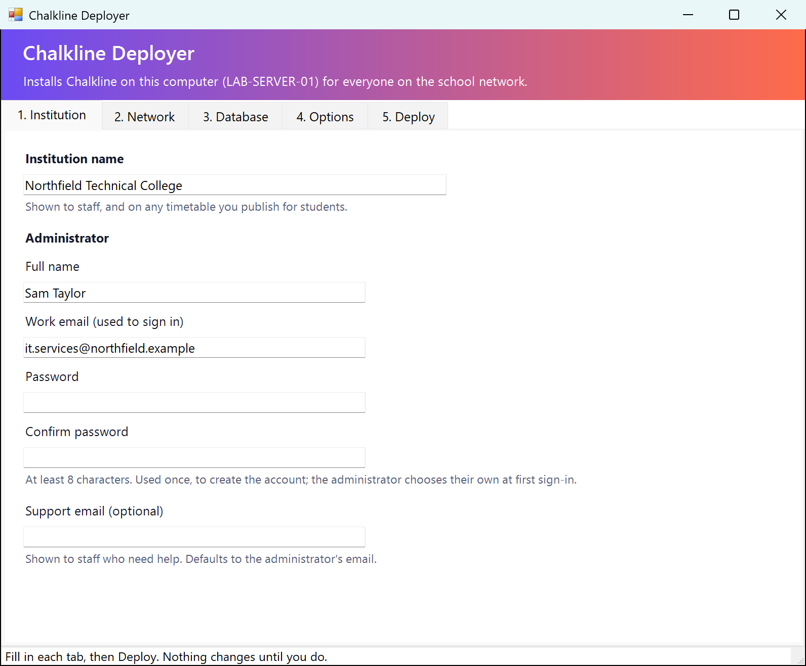
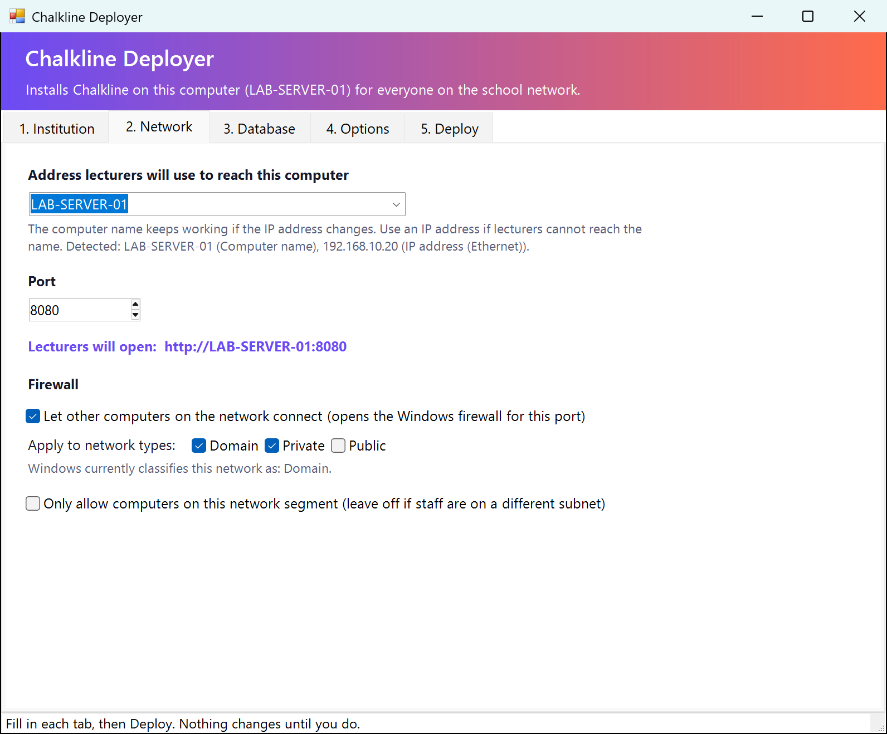

# Chalkline Deployer for Windows

Installs Chalkline on one Windows computer so that everyone on the school
network can use it from a browser. Lecturers open an address such as
`http://ICT-LAB-01:8080` and sign in. Nothing is installed on their computers.

It is a form: fill in a few tabs, click **Deploy**, and it does the rest.



---

## What you need

- A Windows 10 or 11 computer that stays switched on during the school day.
  This becomes the server. Any reasonably recent lab PC is enough.
- An administrator account on that computer.
- Internet access the first time, to download Java and build Chalkline.
  No internet on the server? See [Offline install](#offline-install).

Nothing else. The deployer installs Java itself, and Chalkline comes with its
own database.

---

## Step by step

### 1. Download Chalkline

On the computer that will be the server, go to
<https://github.com/5f2cw98msz-source/timetable-saas-app>, click the green
**Code** button, then **Download ZIP**.

Right-click the downloaded file, choose **Extract All**, and extract it
somewhere on the local disk, such as `C:\Chalkline-setup`.

> Extract it first. Running it from inside the ZIP, or from a network drive,
> will not work.

### 2. Start the deployer

Open the extracted folder, then `deploy\windows`, and double-click
**Deploy-Chalkline.cmd**.

Windows will probably show **"Windows protected your PC"**. This appears for
any file downloaded from the internet that is not from a large software
company. Click **More info**, then **Run anyway**.

Then click **Yes** when Windows asks whether to allow it to make changes. It
needs administrator rights to create the background task and open the
firewall.

### 3. Fill in the five tabs

**1. Institution.** The name of the school, and the administrator who will
manage Chalkline: their name, work email and a starting password. The password
is only used to create the account. The administrator is asked to choose their
own the first time they sign in.

**2. Network.** The address lecturers will type. The computer's name is
listed first because it keeps working if the IP address changes; pick an IP
address instead if lecturers cannot reach the name (see
[Lecturers cannot connect](#lecturers-cannot-connect)). Leave the port as
8080 unless something else already uses it. Leave the firewall box ticked.

If the form says the network is classified as **Public**, keep **Public**
ticked under network types. Without it the firewall rule would not apply and
nobody could connect.



**3. Database.** Leave it on **Built-in database** unless your university has
a PostgreSQL server and a team that runs it.

**4. Options.** The defaults are right for a single school:

| Option | Default | Why |
|---|---|---|
| Include every Premium feature | On | Public timetables for students, calendar subscriptions, no limit on staff. No payment is involved. |
| Add sample rooms and courses | Off | Fake data on a real system has to be found and deleted later. |
| Let other institutions sign up | Off | This copy serves one school. |
| Start automatically with Windows | On | It comes back by itself after a restart or a power cut. |
| Back up every night | On, 02:00, keep 14 | See [Backups](#backups). |

**5. Deploy.** Click **Check this computer** first. It confirms Java, the
port and the network without changing anything.

Then click **Preview the changes**. This lists every file it will write,
every setting (passwords hidden) and the firewall and scheduled-task changes,
and changes nothing. Show this to your IT department if they want to know
what is being installed.

Then click **Deploy Chalkline**.

The first deployment takes about five to ten minutes: it downloads Java
(about 180 MB), builds Chalkline, and starts it. The log shows each step.
When it finishes you will see:

```
Deployed.
Lecturers open:  http://ICT-LAB-01:8080
```

### 4. Sign in

Click **Open Chalkline**, or type the address into any browser on the
network. Sign in with the administrator email and the password you chose.
You will be asked to set a new password straight away.

Then, under **Settings**, add rooms and courses, and add lecturers under
**Team** (or share the join link with them).

### 5. Tell the lecturers

Give them the address. The install folder also contains a shortcut called
**Open Chalkline** that you can copy onto other computers' desktops.

---

## Managing it afterwards

Run **Deploy-Chalkline.cmd** again. It remembers your answers from last time
(never the passwords), and the **Manage** row on the Deploy tab has:

- **Start** and **Stop**
- **Status**: whether it is installed, running and answering
- **Back up now**
- **Uninstall**

To change a setting, change it in the form and click **Deploy** again. Your
data is kept.

---

## Where everything is

Everything lives in one folder, `C:\ProgramData\Chalkline` unless you chose
another under Options:

| Folder | What is in it |
|---|---|
| `app\` | `chalkline.jar`, the application |
| `config\` | `application.properties`, its settings. Readable by the service and administrators only, because it can contain the database password. |
| `data\` | The database |
| `logs\` | `chalkline.log`, `deploy.log` and `backup.log` |
| `backups\` | One ZIP per night |
| `tools\` | The script the backup task runs |

Plus two scheduled tasks in Task Scheduler, **Chalkline** and **Chalkline
Backup**, and one firewall rule, **Chalkline (TCP 8080)**.

Chalkline runs as Windows' built-in **LOCAL SERVICE** account, not as an
administrator. It is a web server listening on the network, so if it were ever
compromised it should not hold the keys to the whole computer.

---

## Backups

Every night at the time you chose, Chalkline stops for a few seconds, the
database is copied into a ZIP in `backups\`, and it starts again. Stopping
first is what makes the copy trustworthy: copying a database while it is being
written can produce a backup that will not open.

**A backup that only exists on the same computer is not much of a backup.**
If that disk fails, the backups go with it. Copy the `backups` folder
somewhere else regularly: a USB drive, a network share, or the school's own
backup system.

### Restoring a backup

1. Open the deployer and click **Stop**.
2. Move the contents of `C:\ProgramData\Chalkline\data` somewhere safe (do not
   delete them yet).
3. Extract the backup ZIP you want into `data`.
4. Click **Start**, sign in, and check it is the data you expected.

Try this once **before** you need it.

With PostgreSQL, backups are the database server's job (`pg_dump`, or your
provider's backups). The deployer does not set up nightly backups for it.

---

## Updating to a new version

Download the new ZIP, extract it, and run **Deploy-Chalkline.cmd** from the new
folder. It picks up your previous answers and your data. Take a backup first
with **Back up now**.

---

## Offline install

If the server has no internet access:

1. On any computer that does, build Chalkline: open PowerShell in the
   extracted folder and run `.\mvnw.cmd -DskipTests package`. You need Java 21
   on that computer. This creates `target\chalkline.jar`.
2. On the same computer, download the Java 21 installer from
   <https://adoptium.net/temurin/releases/?version=21> (Windows, JDK, `.msi`).
3. Copy both files to the server, install Java, then run the deployer and
   choose **Use a chalkline.jar I already have** under Options.

---

## Troubleshooting

### Lecturers cannot connect

Work through these in order:

1. **Can the server itself open it?** On the server, browse to
   `http://localhost:8080`. If that fails, Chalkline is not running: click
   **Status**, then look at `logs\chalkline.log`.
2. **Is the firewall rule there?** The **Chalkline (TCP 8080)** rule should be
   in *Windows Defender Firewall, Advanced settings, Inbound rules*. Re-run
   **Check this computer**: if the network is **Public** and the rule does not
   include Public, re-deploy with Public ticked.
3. **Does the computer name resolve?** From a lecturer's computer, try the IP
   address instead of the name. If the IP works and the name does not, the
   school network does not resolve names. Re-deploy using the IP address, and
   ask IT to give the server a fixed (reserved) IP so it does not change.
4. **Is something between them?** Some school networks separate staff and lab
   computers. If the server's IP does not answer from a staff computer at all,
   ask IT whether traffic between the two networks is blocked.

### Nobody can sign in, but the page loads

This happens if Chalkline is told to use secure cookies while being reached
over plain `http://`. The browser silently drops the cookie, so every sign-in
appears to fail. The deployer sets this correctly, so it usually means
`config\application.properties` was edited by hand. Re-run the deployer.

### "Port 8080 is in use"

Something else already uses that port. Pick another, such as 8090, under
**Network**, and deploy again. Lecturers then use `http://NAME:8090`.

### "Running scripts is disabled on this system"

Start the deployer with **Deploy-Chalkline.cmd**, not by right-clicking the
`.ps1` file. The `.cmd` relaxes the policy for that one window only and
changes nothing permanent.

### Java will not install

Usually no internet, or a proxy that blocks downloads. Use the
[offline install](#offline-install).

### The build fails

The first build downloads Maven and around 80 MB of libraries. A proxy or a
very slow connection can interrupt it. Try again, or build on another computer
and use the [offline install](#offline-install).

### Anything else

Once the install folder exists, every deployment is also recorded in
`logs\deploy.log`, including the reason if it stopped, and Chalkline's own log
is `logs\chalkline.log`. The end of one of those almost always says
what went wrong.

---

## Things to know

**Traffic is not encrypted.** Chalkline is reached over `http://`, so on the
school network, passwords travel unencrypted between a lecturer's browser and
the server. On a school network that is a common trade-off, but it is a real
one. To fix it, put HTTPS in front of Chalkline using the school's own
certificate (IIS with URL Rewrite, or Caddy), then set
`server.servlet.session.cookie.secure=true` and change `app.public-url` to the
`https://` address in `config\application.properties`.

**One computer, one point of failure.** If the server is switched off, nobody
can use Chalkline. Put it on a computer that stays on, ideally on a UPS, and
give it a fixed IP address.

**The administrator password is used once.** It creates the account on first
start, is then removed from the settings file automatically, and the
administrator must choose their own when they first sign in.

---

## For IT departments

Everything the form does is in `ChalklineDeploy.psm1`, a PowerShell module
with no user interface that you can read, audit, or drive from your own
tooling:

```powershell
Import-Module .\ChalklineDeploy.psm1
$config = @{
    InstitutionName = 'Example University'
    AdminEmail      = 'it@example.edu'
    AdminPassword   = '<starting password>'
    ServerAddress   = 'CHALKLINE01'
}
Invoke-ChalklineDeploy -Config $config -Preview   # shows the plan, changes nothing
Invoke-ChalklineDeploy -Config $config            # deploys
```

`Get-Command -Module ChalklineDeploy` lists every function. The tests are in
`tests\` and run with [Pester](https://pester.dev) 5 or later:
`Invoke-Pester .\tests`.

It works with Windows PowerShell 5.1, which every Windows 10 and 11 computer
has. It needs nothing else, and downloads only Java, from adoptium.net,
checking it against the published checksum before installing it.

To learn how it works inside, and how to change it safely, read
[HOW-THE-INSTALLER-IS-MADE.md](HOW-THE-INSTALLER-IS-MADE.md).
